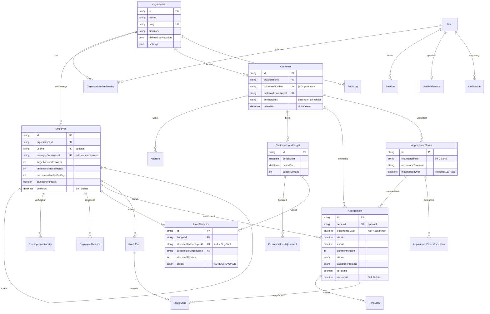

# Datenmodell

Vollständiges Schema: [prisma/schema.prisma](../prisma/schema.prisma). Alle
Geschäftsdaten tragen `organizationId` (Mandantentrennung); Zeitmengen sind ganzzahlige
Minuten; Zeitstempel UTC; „Datums“-Felder (Budgets, Serientage, Routendatum) sind
UTC-Mitternacht. Soft Delete über `deletedAt` (Kunden, Mitarbeiter, Termine).

## ERD (Kernentitäten)

Zusätzlich: `Session`, `PasswordResetToken`, `Invitation` (Auth/Einladungen) sowie
`Notification` und `AuditLog`.

## Wichtige Entscheidungen

- **Hierarchie** über selbstreferenzierendes `managerEmployeeId`; Zyklen verhindert die
  reine Funktion `wouldCreateCycle` (`src/lib/hierarchy.ts`, getestet); Unterbäume werden
  in JS über die (kleine) Org-Mitarbeitermenge berechnet.
- **Pool-Modell der Zuweisungen:** `allocatedByEmployeeId = null` verbraucht das
  Kundenbudget; gesetzt = Weitergabe aus dem Pool des Managers (keine Doppelzählung).
- **Serien-Ausnahmen** als eigene Tabelle mit Unique(`seriesId`, `occurrenceDate`) –
  Materialisierung überspringt Ausnahmedaten, Einzeländerungen bleiben erhalten.
- **Start-/Zielorte** (Organisation, Mitarbeiter, Routen) als strukturierte JSON-Standorte
  (Label, Adresse, Koordinaten) – `Address`-Zeilen sind Kundenadressen mit
  Geocoding-Metadaten.
- **RoutePlan** eindeutig je (`employeeId`, `routeDate`); Neuberechnung ersetzt den Plan.
- **Indizes** auf allen Filterpfaden: `organizationId`-Kombinationen, `startAt`/`endAt`,
  `assignedEmployeeId+startAt`, `customerId+startAt`, Budget-Perioden, `routeDate`,
  Status- und `deletedAt`-Kombinationen (siehe Schema).
- **Transaktionen** überall dort, wo Stunden, Termine oder Zuweisungen gemeinsam mit
  Audit-Einträgen geändert werden (`db.$transaction`).
